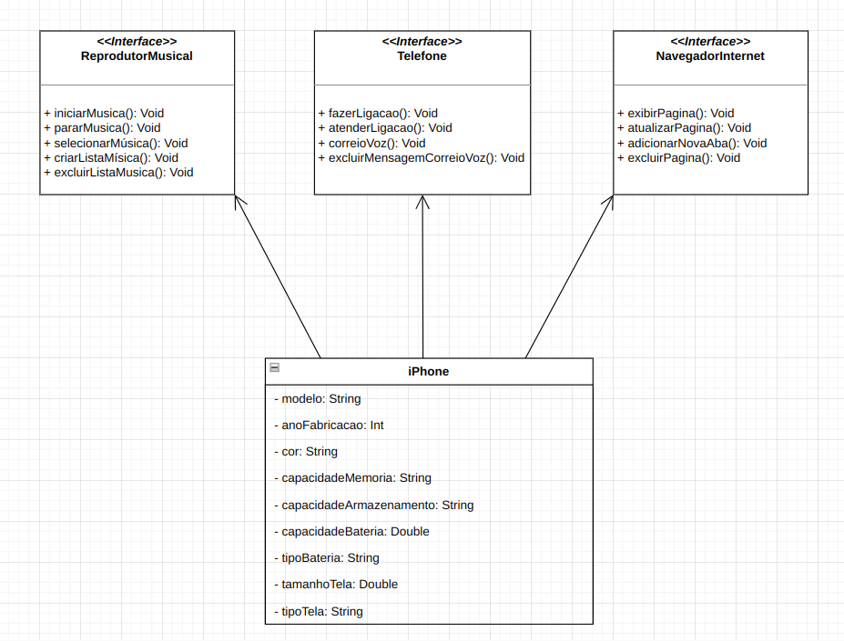
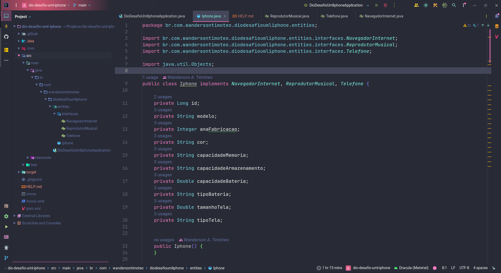
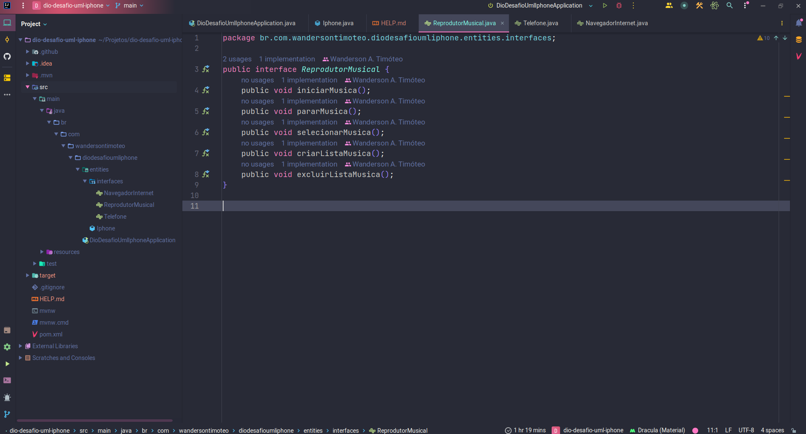
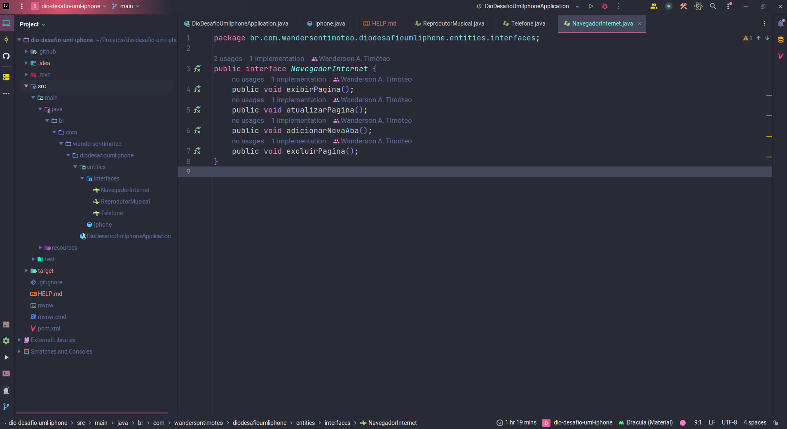
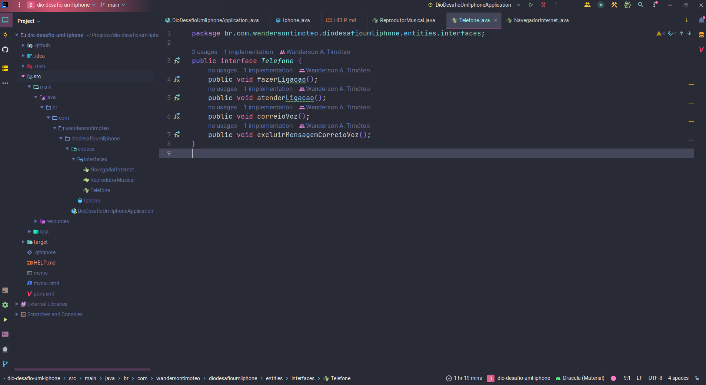
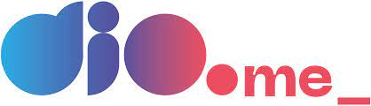

  <h1>Orientação a Objetos e UML: Diagramação de Classes do iPhone</h1>

  <a href="#-projeto">Projeto</a>&nbsp;&nbsp;&nbsp;|&nbsp;&nbsp;&nbsp;
  <a href="#-tecnologias">Tecnologias</a>&nbsp;&nbsp;&nbsp;|&nbsp;&nbsp;&nbsp;
  <a href="#-licença">Licença</a>&nbsp;&nbsp;&nbsp;|&nbsp;&nbsp;&nbsp;
  <a href="#-autor">Autor</a>

 

  
  
  

 

## 💻 Projeto

Este projeto visa apresentar o resultado do desafio do curso DIO: Orientação a Objetos e UML - Diagramação de Classes do iPhone, referente ao lançamento do iPhone por Steve Jobs.

 

### Diagrama

    

 

### Entity IPhone

    

 

### Interface Reprodutor Musical

    

 

### Interface Navegador de Internet

    

 

### Interface Telefone

    

 

## 🚀 Tecnologias

Esse projeto foi desenvolvido com as seguintes tecnologias e ferramentas:

  
  
  

 

## 🚩 Tenho Dúvidas... O que fazer?

Caso tenha dúvidas sobre o código do projeto, sinta-se a vontade em abrir uma **[ISSUE AQUI](https://github.com/Wanderson-A-Timoteo/dio-desafio-uml-iphone/issues)**. Assim que possível, responderei todas as dúvidas!

 

## 💡 Licença

Esse projeto está sob a licença MIT. Veja o arquivo [LICENSE](github/LICENSE.md) para mais detalhes.

 

## 🎆 Autor

Feito com ♥ by

[ Wanderson A. Timóteo](https://wanderson-a-timoteo.github.io/my-portfolio-dark-light/)

 

## 🤝 Agradecimentos

  

  

Projeto desenvolvido durante as aulas do curso `Orientação a Objetos e UML: Diagramação de Classes do iPhone` da plataforma de ensino [Dio.me](https://www.dio.me/).
